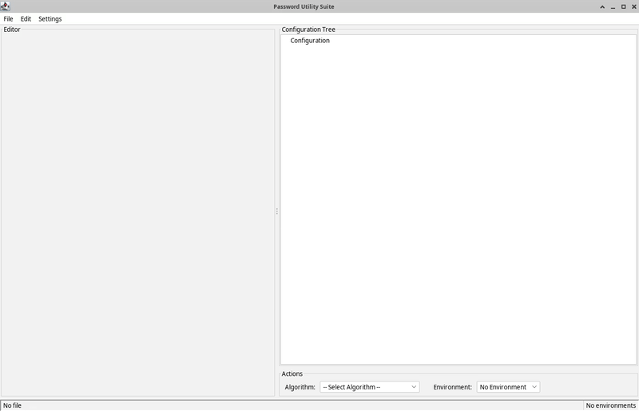

= Password Utility Suite

image:https://github.com/dataliquid/password-utility-suite/actions/workflows/ci.yml/badge.svg[CI Build,link=https://github.com/dataliquid/password-utility-suite/actions/workflows/ci.yml]
image:https://img.shields.io/maven-central/v/com.dataliquid/password-utility-suite.svg[Maven Central,link=https://search.maven.org/artifact/com.dataliquid/password-utility-suite]

A Java Swing application for encrypting and decrypting sensitive values in YAML and Properties configuration files. Manage secrets across multiple environments (development, staging, production) with environment-specific master passwords and support for various encryption algorithms.

== Features

* **Multiple Environments**: Configure separate environments (dev, staging, prod) with individual master passwords
* **Visual Editor**: Swing-based GUI with syntax highlighting and tree-view for configuration structure
* **In-Place Encryption**: Encrypt/decrypt values directly in the editor
* **Format Support**: YAML and Properties files
* **Multiple Algorithms**: AES-256-GCM (default), AES-256-CBC, MuleSoft-compatible formats, Blowfish
* **Modern UI**: FlatLaf Look & Feel for a clean, modern interface

== Technical Stack

* **Java**: 17+
* **Build Tool**: Maven
* **GUI Framework**: Java Swing with https://www.formdev.com/flatlaf/[FlatLaf] Look & Feel
* **YAML Parser**: https://bitbucket.org/snakeyaml/snakeyaml[SnakeYAML]
* **Encryption**: Java Cryptography Architecture (JCA)
* **Testing**: JUnit 5, AssertJ, Mockito, AssertJ Swing

== Quick Start

=== Prerequisites

* Java 17 or higher
* Maven 3.6.0 or higher

=== Build and Run

[source,bash]
----
# Clone the repository
git clone https://github.com/dataliquid/password-utility-suite.git
cd password-utility-suite

# Build the project
mvn clean install

# Run the application
mvn exec:java -Prun

# Build fat JAR
mvn package -Pfat-jar

# Run the fat JAR
java -jar target/password-utility-suite-1.0.0-SNAPSHOT.jar
----

=== First Steps

1. Start the application
2. Press `Ctrl+E` to open the Environments dialog
3. Create a new environment with a master password
4. Open or create a YAML/Properties file
5. Select values in the tree view and click "Encrypt" or "Decrypt"

== Supported Encryption Algorithms

[cols="1,2,1"]
|===
|Algorithm |Description |Default

|AES-256-GCM
|AES with Galois/Counter Mode - authenticated encryption
|✓

|AES-256-CBC
|AES with Cipher Block Chaining mode
|

|MuleSoft AES-CBC
|MuleSoft-compatible AES-CBC format
|

|MuleSoft AES-CBC (Password IV)
|MuleSoft format with password-derived IV
|

|Blowfish
|Blowfish encryption algorithm
|
|===

== Format Support

* **YAML**: Full support for nested structures, lists, and complex configurations
* **Properties**: Standard Java properties files

Encrypted values are marked with configurable prefixes/suffixes (default: `ENC[...]` or `SEC[...]`)

== Documentation

* link:docs/USER_GUIDE.adoc[User Guide] - Complete usage documentation
* link:CONTRIBUTING.adoc[Contributing Guide] - How to contribute to the project
